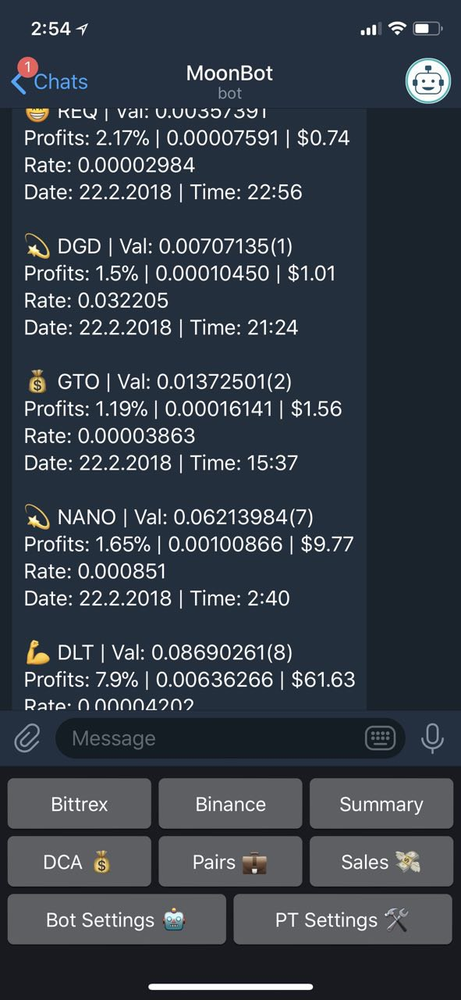

# MoonBot

MoonBot is a private telegram bot that helps you monitor and track your crypto tradings. 
Moonbot supports **Profit Trailer**, you can see (and share) your sales, pairs and dca status as well as updating your bot settings remotely (**PT Feeder** too)! 

[Get your version now!](https://github.com/tulihub/moonbot/wiki/Quick-Installation)

Advanced features are included in Premium (lifetime licence) membership. 
Install your version and get 48h trial of Premium features!
  

* Get instant updated summary of all your crypto exchanges
* View and share your sales, pairs and dca status
* Get notifications when your bot buys or sell (dca too!)
* Update and control your PT from everywhere!
* Update PT Feeder settings from everywhere!
* Track your profit in BTC and in USD (coinbase rate)
* Get your portfolio status anytime
* Clear view of your current tradings on each exchange
* Monitor you PT log files for error and sends you alerts!
* Monitor BTC price 
* Get notified when your Profit Trailer is down
* Group support!
* More to come!!! 

### Main Commands: 
Summary: View summary of your accounts. 
Binance: Show binance status including coin information. 
Bittrex: bittrex status including coin information. 
Sales 💸 (/sales [n]): Display latest n (5) Profit Trailer sells. 
Pairs 💼 (/pairs [n]): Display current n (all) pairs. 
DCA 💰 (/dca [n]): Display n n (all) DCAs. 
PT Settings 🛠: Remote update your Profit Trailer / Feeder settings. 
Bot Settings 🤖: Update MoonBot settings & /help . 
/togglesom : Instant toggling of SOM (ALL_sell_only_mode) on/off. 
 
You can type 'Cancel' (/cancel) anytime to go back home. 
 
### Groups: 
Invite your bot to groups! 
Use the following commands to share Profit Trailer sales, pairs and dca(s) status: 
/sales [n]: Share latest n (5) sells. 
/pairs [n]: Share current n (all) pairs. 
/dca [n]: Share n (all) DCAs. 
/allowgroup : ⛔️ Allow all group members to control your bot. 
/bangroup : Ban group members from controlling your bot. 
Don't forget to mention your bot name (@<your_bot>)  
 
Terminology: 
(sat): 1 satoshi = 0.00000001 BTC. 
Bal: Life time balance (all_sells - all_buys + current_balance). 
Val: Current value of your holdings. 
 
### More info:  
Telegram: https://t.me/AssistantMoonBot  
Discord: https://discord.gg/aJ3Ryu7  

[Get your version now!](https://github.com/tulihub/moonbot/wiki/Quick-Installation) 
Demo preview available here: https://t.me/AssistantMoonBot  

#Supports Binance and Bittrex exchanges.
