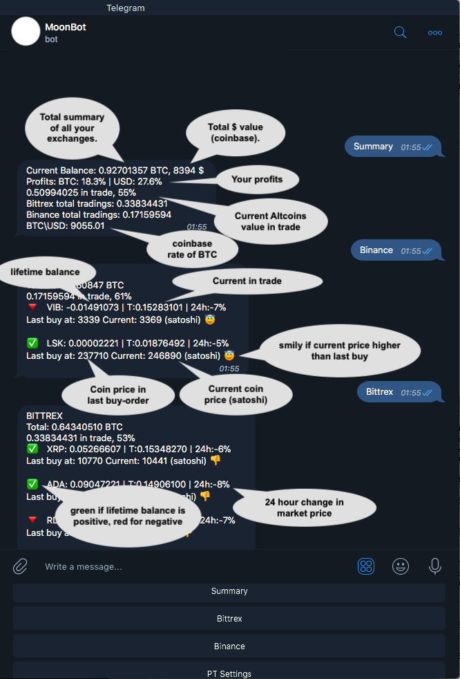

# MoonBot

A private Telegram bot to track, monitor (and much more) all your crypto trading exchanges.

MoonBot supports Profit Trailer and lets you update your PT settings from everywhere!

[Get your version now!](https://github.com/tulihub/moonbot/wiki/Installation)

* Get instant updated summary of all your crypto exchanges
* Update PT settings from everywhere!
* Track your profit in BTC and in USD (coinbase rate)
* Get your portfolio status anytime
* Clear view of your current tradings on each exchange
* Monitor BTC price 
* Get notified when your Profit Trailer is down

Telegram Group: https://t.me/MoonBot_com

Premium Assistant: https://t.me/AssistantMoonBot

[Get your version now!](https://github.com/tulihub/moonbot/wiki/Installation)

Next to come:
* Place a sell\buy order on specific coin
* [DONE] Update Profit Trailer settings
* Notification on each new sell\buy order

#Supports Binance and Bittrex exchanges.

#Lifetime Balance:
lifetime balance is a calculation of your all trade history for that coin + its current balance. 
balance = (all_sells - all_buys) + current balance.
